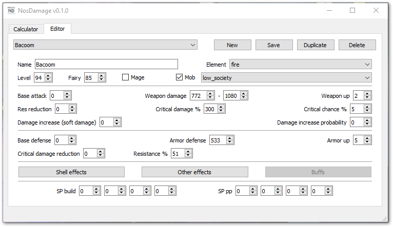
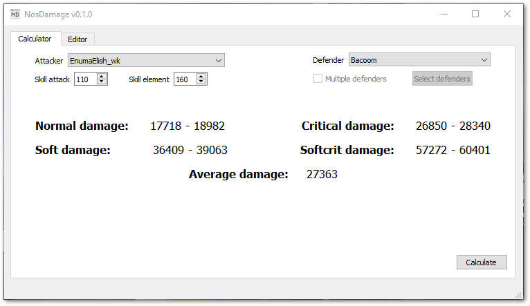

# NosDamage

NosDamage is a damage calculator (and much more to come in the future) for the
MMORPG NosTale.  
The project is based on [this](https://forum.vendettagn.com/index.php?/topic/2749-formula-damage/)
formula (you can find the original thread on the Italian forum
[here](https://board.it.nostale.gameforge.com/index.php/Thread/88530-Formula-del-Danno-Aggiornata-e-ancora-in-fase-di-aggiornamento/)).
Please note that the formula is only 98~99% accurate in PvE, mainly due to things like
hidden monster stats. This could possibly affect calculations offsetting high
elemental damage (usually when it's higher than 20k) by few hundreds (100-200
compared to 20k+ damage is fairly negligible, in my opinion, for the purposes of
this calculator).

## Installation and usage
You can download the latest version [here](https://github.com/Gilgames000/nos-damage/releases/download/v0.1.0-beta/NosDamage.zip)
or check all previous releases [here](https://github.com/Gilgames000/nos-damage/releases).
Once you downloaded the zip file, just extract it wherever you like and run the NosDamage
executable that you find inside the folder.  
As of now there are two tabs available: editor and calculator.

#### Editor
From here you can create/edit/delete attackers and defenders. In the future I will add some
tooltips for people who don't know what all effects mean; for now you can ask/check on the 
forum threads I linked above if you're unsure about something, or you can contact me (check my
contacts at the end of this page).

#### Calculator
This is the main feature of the application. From here you can choose one attacker, one 
defender from the dropdown menus, press calculate and check the estimated damage output.
This can be useful, for example, if you want to compare two shells/weapons/sp builds/etc.
 
## Updating the application
Once a new version is released, the application will ask you to go to the download page.
Download the latest version from there, extract it wherever you want and you're good to go.
If you want to keep your previously created attacker/defender files, you can find those
in the `entities` folder; just copy it to the location where you extracted the new version
of the app.

## Currently implemented features
The graphical user interface is not pretty at the moment; it's been created with the sole
purpose of easily manage the calculator and its features, which at the moment, are:

- Damage calculator (normal/crit/soft/softcrit/average)
- Editor to handily create and manage your attackers/defenders

There is also an sp build optimizer that, at the moment, is only available through
command line interface. It will take the stats of the character you input as
attacker and brute-force through all possible builds against one or more defenders to find
the one with the highest (average) damage output.
You can specify job/up of your sp and your SLs.

## Screenshots

## Troubleshooting
If you find any bugs or get an error while using the application, please
[open an issue](https://github.com/Gilgames000/nos-damage/issues)
or contact me (check contacts below).  

When filing a new bug, please include:

#### What to include in a bug report?
- Descriptive title
- Detailed steps to reproduce the bug
- Expected behaviour and what happens instead
- Screenshots if you think it's needed

## Upcoming features
- SP build damage output optimizer (just needs to be added to the GUI)
- Option to calculate average damage against multiple defenders (as above, just
  TBA to the GUI)
- Buffs and debuffs effects
- Total HP calculation based on SP build/bonuses/pp, accessories, etc.
- HP recovery calculation based on base recovery, skills, accessories, etc.
- More sample attacker/defender files (I was planning to add all the most common
  mobs like act 6 and LoD ones)
- UI/UX improvements
- Error checking
- Unit testing
- And much more!  

## Contacts
- Telegram: [Gilgames](https://t.me/Gilgames)
- Discord: Gilgames#3236
- NosTale Vendetta Forum: [Gilgames](https://forum.vendettagn.com/index.php?/profile/4671-gilgames/)
- NosTale IT Forum: [Gilgames](https://board.it.nostale.gameforge.com/index.php/User/45597-Gilgames/)
- NosTale EN Forum: [Gilgames](https://board.en.nostale.gameforge.com/index.php/User/34739-Gilgames/)